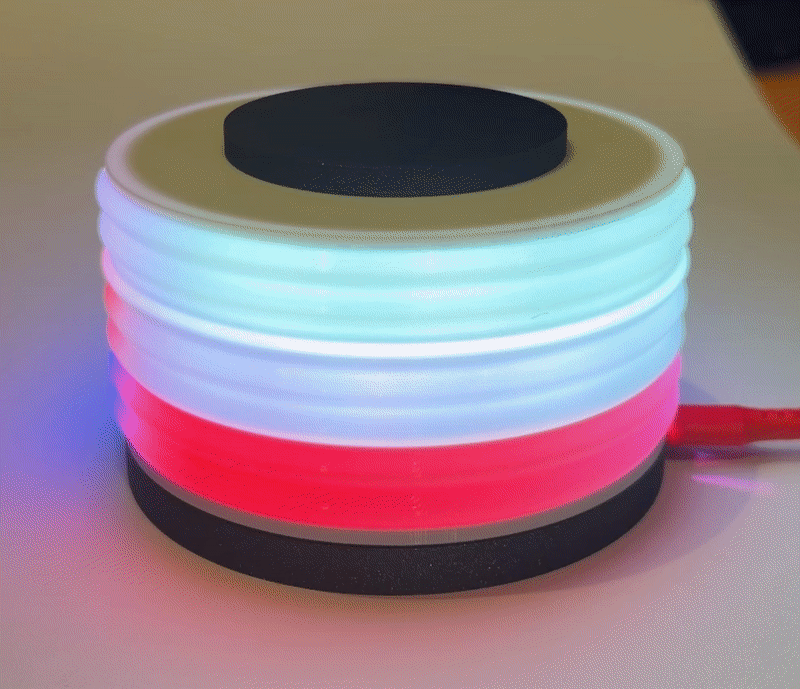
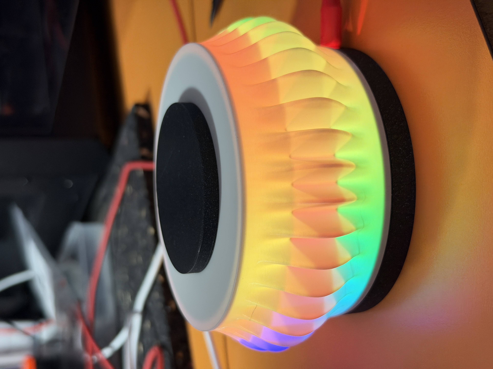
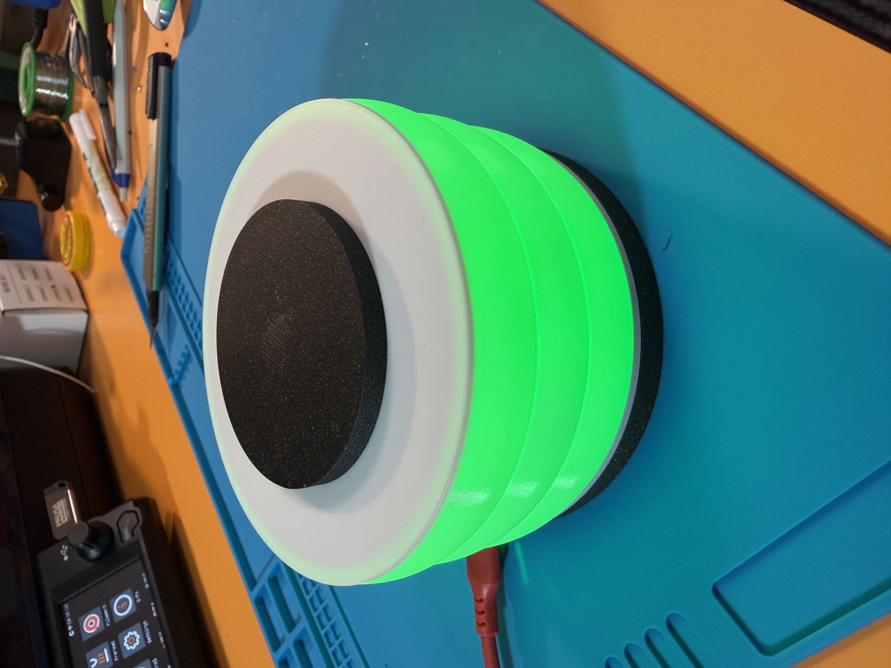
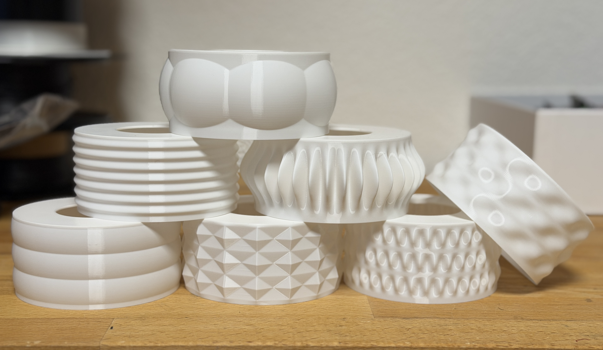

# LED Mini Lamp

An open-source, 3D-printable LED lamp powered by WLED.

  
  

  

  

  
  

## Start here

- [Bill of materials](docs/bom.md)
- [Printing the PLA parts](docs/printing.md)
- [Installing WLED firmware](docs/install-wled.md)
- [Setting up WLED](docs/wled-setup.md)
- [Assembly](docs/assembly.md)
- [Using your lamp](docs/using-your-lamp.md)

## Licence

This project is licensed under [CC BY-SA 4.0](LICENSE.md).
