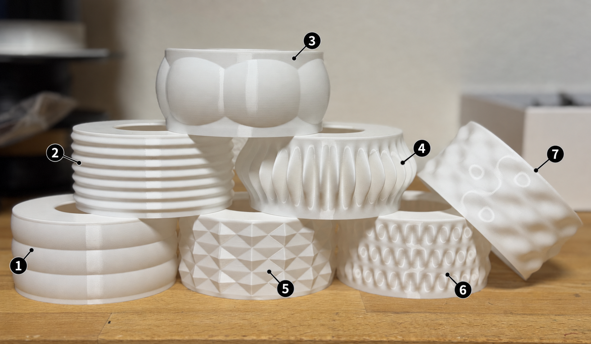

# Printing the parts

This page is the print plan for the LED Mini Lamp. Each part is supplied as an
STL and, where available, as a 3MF slicer project. Both formats are already in
the correct printing orientation.

All parts are designed for a **0.4 mm nozzle**. **No supports or brims are
needed**. A few bridges are present, but they are designed to print on almost
any printer.

## Material

All supplied print settings are for **PLA** and were tested with **Prusament
PLA**. Print the diffusors in **white PLA** so they work as intended. For the
core structure, base, top plug, and clip, choose any PLA colour you like.

## What to print

### Core structure — print 3

Print **three** copies of the core structure.

**Print settings**

- **0.28 mm draft** layer height is suitable; this part is not critical.
- Use **15% infill or more**.

| Part | STL | Print volume (X × Y × Z) | 3MF |
| --- | --- | --- | --- |
| Core structure | [STL](../print-files/stl/lamp_core_structure.stl) | 94 × 94 × 25 mm | [3MF](../print-files/3mf/lamp_core_structure.3mf) |

### Standard parts

Print one of each of these standard parts.

**Print settings**

- **0.28 mm draft** layer height is suitable; these parts are not critical.
- Use **15% infill or more**.

| Part | STL | Print volume (X × Y × Z) | 3MF |
| --- | --- | --- | --- |
| Lamp base | [STL](../print-files/stl/lamp_base.stl) | 100 × 100 × 16 mm | [3MF](../print-files/3mf/lamp_base.3mf) |
| Top plug | [STL](../print-files/stl/lamp_top_plug.stl) | 60 × 60 × 33.3 mm | [3MF](../print-files/3mf/lamp_top_plug.3mf) |

### Clip unit

The clip uses a finer, stronger print recipe than the standard parts. Open the
dedicated 3MF project when possible.

**Print settings**

- Layer height: **0.10 mm**
- **4 perimeters**
- **100% infill**

| Part | STL | Print volume (X × Y × Z) | 3MF |
| --- | --- | --- | --- |
| Clip unit | [STL](../print-files/stl/lamp_clip_unit.stl) | 15 × 36 × 6 mm | [3MF](../print-files/3mf/lamp_clip_unit.3mf) |

### Diffusors — choose one or more

The diffusor is the visible shade of the lamp. Pick any design below; you can
print more than one to swap the appearance of the lamp later. Use **white PLA**.

Diffusors need their own recipe: do not print them with the standard-part
settings. Vase mode and the controlled bottom thickness are important, so open
the dedicated 3MF project when possible.

**Print settings**

- Recommended layer height: **0.20 mm**
- Enable **vase mode**.
- Use enough bottom layers to make a base **about 1.4–1.5 mm thick**. At
  0.20 mm layer height, this is **7 bottom layers**. Adjust the layer count if
  you use a different layer height.

| Design | STL | Print volume (X × Y × Z) | 3MF |
| --- | --- | --- | --- |
| Bulges | [STL](../print-files/stl/lamp_diffusor_bulges.stl) | 102.7 × 102.7 × 50 mm | [3MF](../print-files/3mf/lamp_diffusor_bulges.3mf) |
| Pumpkin | [STL](../print-files/stl/lamp_diffusor_pumpkin.stl) | 111.2 × 110.8 × 50 mm | [3MF](../print-files/3mf/lamp_diffusor_pumpkin.3mf) |
| Seven ripple | [STL](../print-files/stl/lamp_diffusor_seven_ripple.stl) | 103.2 × 103.2 × 50 mm | [3MF](../print-files/3mf/lamp_diffusor_seven_ripple.3mf) |
| Single sinusoidal bulge | [STL](../print-files/stl/lamp_diffusor_single_sinusoidal_bulge.stl) | 119.9 × 119.9 × 50 mm | [3MF](../print-files/3mf/lamp_diffusor_single_sinusoidal_bulge.3mf) |
| Sinusoidal 12 bubbles | [STL](../print-files/stl/lamp_diffusor_sinusoidal_12_bubbles.stl) | 103.4 × 103.4 × 50 mm | [3MF](../print-files/3mf/lamp_diffusor_sinusoidal_12_bubbles.3mf) |
| Sinusoidal 36 wave ×3 | [STL](../print-files/stl/lamp_diffusor_sinusoidal_36_wave_x3.stl) | 104.1 × 104.1 × 50 mm | [3MF](../print-files/3mf/lamp_diffusor_sinusoidal_36_wave_x3.3mf) |
| Starburst | [STL](../print-files/stl/lamp_diffusor_starburst.stl) | 106.2 × 106.2 × 50 mm | [3MF](../print-files/3mf/lamp_diffusor_starburst.3mf) |

The seven available designs: **1** Bulges · **2** Seven ripple · **3** Pumpkin · **4** Single sinusoidal bulge · **5** Starburst · **6** Sinusoidal 36 wave ×3 · **7** Sinusoidal 12 bubbles.

## Estimated print resources

Measured on a **Prusa Core One L** using the supplied 3MF projects. The total
below is for one lamp with **one diffusor** and **three core structures**.
Filament costs use **€24.50/kg**. Actual values vary with filament, slicer,
and printer.

| Part | Filament weight | Filament length | Print time | Filament cost |
| --- | ---: | ---: | ---: | ---: |
| Core structures (3) | 35.25 g | 11.80 m | 55 min | €0.86 |
| Top plug | 17.60 g | 5.90 m | 25 min | €0.43 |
| Clip unit | 1.93 g | 0.65 m | 11 min | €0.05 |
| Lamp base | 27.84 g | 9.34 m | 27 min | €0.68 |
| Diffusor (one) | 18.08 g | 6.06 m | 49 min | €0.44 |
| **Total** | **100.70 g** | **33.75 m** | **2 h 47 min** | **€2.47** |
