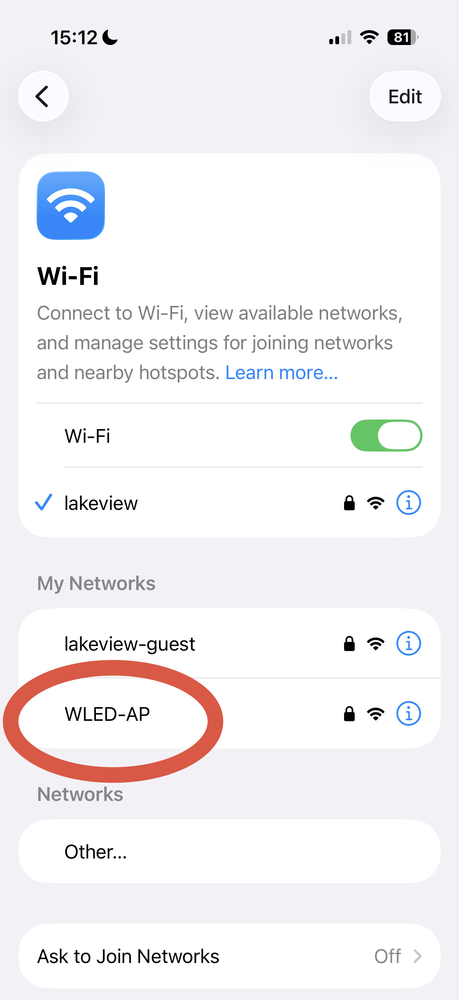
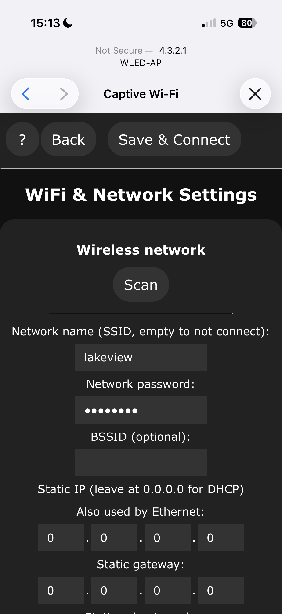
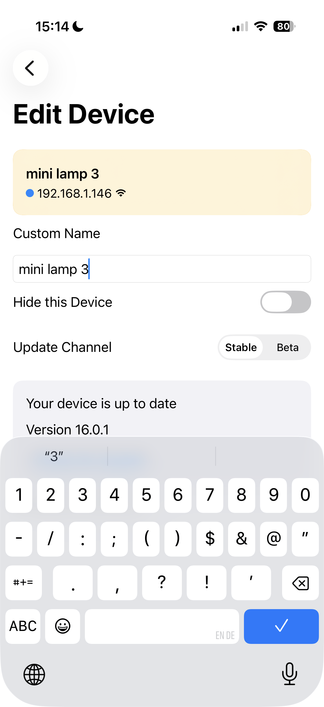
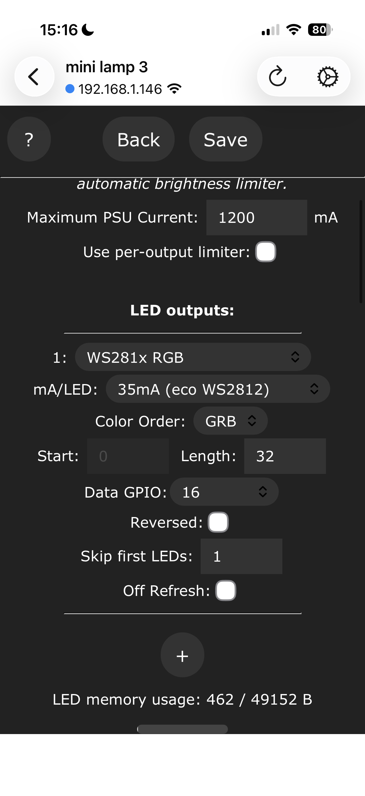

# Setting up WLED

First [install WLED firmware onto the ESP32](install-wled.md). This page covers
only the lamp-specific configuration after WLED is running.

## App and first connection

Install the free **WLED** app on [Android](https://play.google.com/store/apps/details?id=ca.cgagnier.wlednativeandroid)
or [iOS](https://apps.apple.com/gb/app/wled-native/id6446207239). The app is
useful for finding and controlling the lamp, but the same setup can also be
done in a web browser.

1. Power the lamp through the ESP32 USB port.
2. On a phone or computer, connect to the temporary Wi-Fi network named
   `WLED-AP`. The default password is `wled1234`.

   

3. The WLED app usually opens automatically. If it does not, open the app
   manually. As a backup, open [wled.me](http://wled.me) or `http://4.3.2.1`.
4. Open **Config → WiFi & Network**.
5. Enter the name and password of your home Wi-Fi network.

   

6. Optional: set the **mDNS address / hostname** to the name you want for the lamp, for
   example `led-mini-lamp`. It will then be available at
   `http://led-mini-lamp.local` on most home networks.
7. Save the settings. The lamp restarts and joins your home Wi-Fi network.

Reconnect your phone to the same home Wi-Fi network. The WLED app should find
the lamp automatically; select it to control it.

You can also give the lamp a custom name in the WLED app, so it is easy to identify when you have more than one device.

## LED and hardware settings

Open **Config → LED & Hardware** and configure the LED output as follows:

| Setting | Value |
| --- | --- |
| LED type | WS281x |
| LED count | 32 |
| Skip first LEDs | 1 |
| mA/LED | 35 mA (Eco WS2812) |
| Maximum PSU current | 1200 mA |

The physical strip has 35 LEDs. The first LED and the final two LEDs are only
used to attach the strip to the structure, so WLED skips the first and controls
only the 32 LEDs in between.

Save the configuration. The lamp is now ready to use from the WLED app or its
web interface.

For WLED installation methods and general troubleshooting, use the
[official WLED documentation](https://kno.wled.ge/basics/getting-started/).
